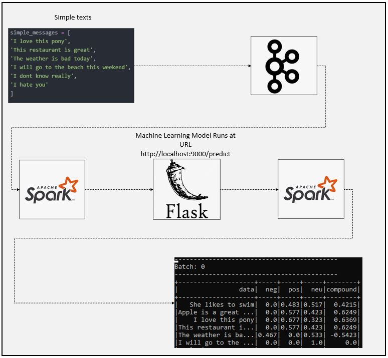

# SparkStream Machine Learning Application 01
### Dataflow Pipeline


### Task List

- [x] Install kafka-python (pip install kafka-python)
- [x] Create kafka_producer.py
- [x] Create simple message to send kafka topic and analyse later
```
simple_messages = [
'I love this pony',
'This restaurant is great',
'The weather is bad today',
'I will go to the beach this weekend',
'I dont know really',
'I hate you'
]
```
- [x] Set-up kafka producer
```
producer = KafkaProducer(bootstrap_servers=['127.0.0.1:9092'])
```
- [x] Set up function to send data as key-value pair
```
def kafka_producer():

	for data in simple_messages:
		data = {'data':data}
		producer.send('test', value=json.dumps(data).encode('utf-8'))
		producer.flush()
		sleep(0.5)
	print("Messages are sent")
```
- [x] Create flask application (app.py)
- [x] Import nltk library for sentiment analysis
```
from flask import Flask, jsonify, request
import nltk
from nltk.sentiment.vader import SentimentIntensityAnalyzer
```
- [x] Initiate flask app and machine learning model
```
app = Flask(__name__)
sid = SentimentIntensityAnalyzer()
```
- [x] Create prediction route to request json post and send it to ml model
```
@app.route('/predict', methods=['POST'])
def predict():
    response = request.get_json()
    result = sid.polarity_scores(response['data'])
    return jsonify(result)
```
- [x] Create spark file (spark_kafka_ml.py)
- [x] Create spark SparkSession

```
#Create spark session
spark = SparkSession \
    .builder \
    .appName('RealtimeKafkaML') \
    .master("local[3]") \
    .config("spark.streaming.stopGracefullyOnShutdown", "true") \
    .getOrCreate()
```

- [x] Read from kafka and define schema

```
#Read message from kafka KafkaProducer
#kafka_producer.py generates message
kafka_df = spark \
    .readStream \
    .format('kafka') \
    .option('kafka.bootstrap.servers', "localhost:9092") \
    .option("startingOffsets", "earliest") \
    .option('subscribe', 'test') \
    .load()

#Schema is created to define scheme for message generated by kafka_producer.py
#When you look at kafka_producer key value is "data"
schema = StructType([StructField('data', StringType())])
#Schema_output is create to define schema when we get response from machine learning model
schema_output = StructType([StructField('neg', StringType()),\
                            StructField('pos', StringType()),\
                            StructField('neu', StringType()),\
                            StructField('compound', StringType())])
```

- [x] Create user defined function to send df to http address

```
def apply_sentiment_analysis(data):

    result = requests.post('http://localhost:5000/predict', json=json.loads(data))
    return json.dumps(result.json())
```

- [x] Get result back and create structure

```
#User defined function created to send read value to flask
vader_udf = udf(lambda data: apply_sentiment_analysis(data), StringType())

value_df = kafka_df.select(from_json(col("value").cast("string"),schema).alias("sentence"),\
                           from_json(vader_udf(col("value").cast("string")),schema_output).alias("response"))
value_df.printSchema()

#We select sentence and response values
explode_df = value_df.select("sentence.data", "response.*")
```

- [x] Write stream to console

```
#Write stream to console
console_query = explode_df \
    .writeStream \
    .trigger(processingTime="1 minute") \
    .format("console") \
    .outputMode("append") \
    .option("checkpointLocation", "chk-point-dir") \
    .start()

console_query.awaitTermination()
```

- [] Create Elasticsearch database
- [] Sink data to Elasticsearch
- [] Create visualization using Kibana

### Code Description

kafka_producer.py is used to create kafka producer and topic finally send defined sentence to kafka

app.py is used to create run machine learning model that wait for data to make sentimental analysis

spark_kafka_ml.py is used to create read data from kafka, send data to Flask api and finally sink result to console

### Running

1. Start zookeeper (Check kafka scripts)

```
zookeeper-server-start.bat config\zookeeper.properties (zookeeper-server-start.sh for linux)
```

2. Start kafka (Check kafka scripts)
```
kafka-server-start.bat config\server.properties  (kafka-server-start.sh for linux)
```

3. Execute below code first

```
spark-submit kafka_producer.py
```

4. Execute below code

```
python app.py
```

5. Execute below code
```
spark-submit --packages org.apache.spark:spark-sql-kafka-0-10_2.12:3.0.1 spark_kafka_ml.py
```
